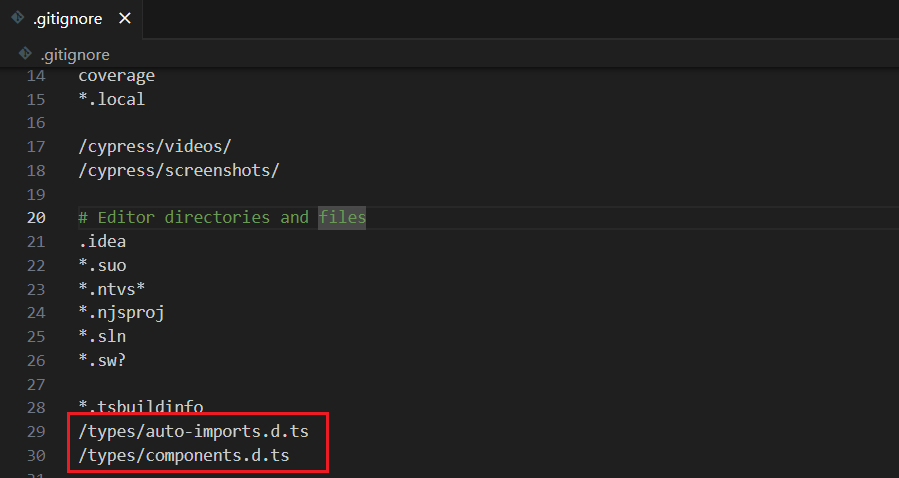

# 自动引入

安装：

```[pnpm]
pnpm install -D unplugin-vue-components unplugin-auto-import
```

vite.config.ts 配置：

```typescript [vite.config.ts]
import AutoImport from 'unplugin-auto-import/vite'
import Components from 'unplugin-vue-components/vite'

// https://vite.dev/config/
export default defineConfig({
  // ...
  plugins: [
    // ...
    AutoImport({
      resolvers: [
        //   ElementPlusResolver(), // 自动导入Element Plus组件
        //   AntDesignVueResolver(), // 自动导入Ant Design Vue组件
        //   TDesignResolver({
        //     library: 'vue-next',
        //   }),
      ],
      imports: [
        'vue', // 自动导入Vue核心API
        'vue-router', // 自动导入Vue Router API
        'pinia' // 自动导入Pinia API
      ],
      dts: './types/auto-imports.d.ts', // 生成类型声明文件的路径
      dirs: ['src/api/backend/**/*.ts', 'src/utils/**/*.ts'] // 自动导入项目中自定义的API和工具函数
    }),
    Components({
      resolvers: [
        //   ElementPlusResolver(), // Element Plus组件库解析器（已禁用）
        //   AntDesignVueResolver({
        //     resolveIcons: true, // 自动导入图标组件
        //     importStyle: false, // 不导入CSS，使用CSS-in-JS方式
        //   }),
      ],
      dts: './types/components.d.ts' // 生成组件类型声明文件的路径
    })
  ]
})
```

忽略文件添加：


