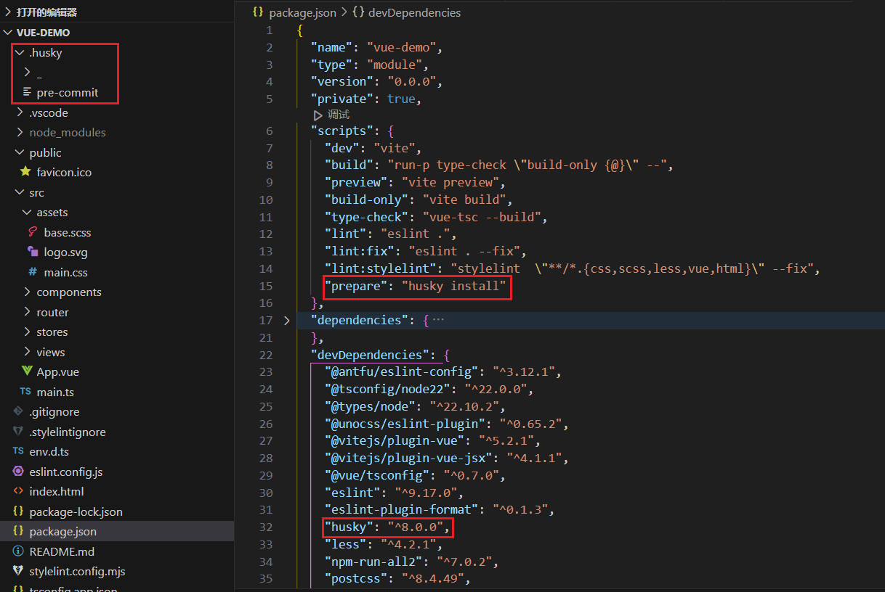
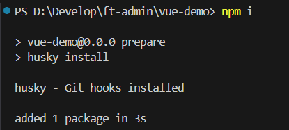
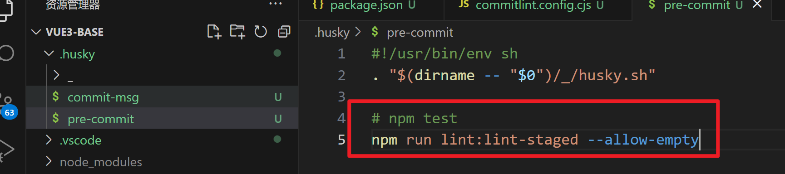
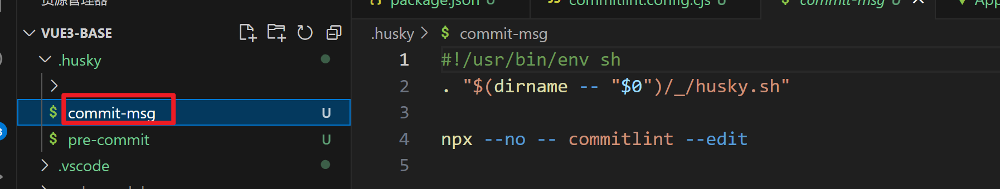
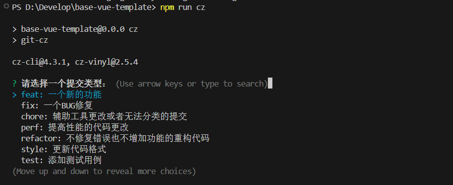

# 代码提交检查

Husky + Lint-staged + Commitlint + Commitizen + cz-git 来配置 Git 提交代码规范。

::: tip

核心内容是配置 Husky 的 pre-commit 和 commit-msg 两个钩子:

- pre-commit：Husky + Lint-staged 整合实现 Git 提交前代码规范检测/格式化 (前提：ESlint + Prettier + Stylelint 代码统一规范)；

- commit-msg: Husky + Commitlint + Commitizen + cz-git 整合实现生成规范化且高度自定义的 Git commit message。

:::

## husky

Husky 是 Git 钩子工具，可以设置在 git 各个阶段（`pre-commit`、`commit-msg` 等）触发。

官网https://typicode.github.io/husky 推荐安装指令

1. 前提条件 项目有.git 如果没有需要生成 有 git 的话不需要这一步

   ```sh
   git init
   ```

2. 自动配置 husky

   ```sh
   npx husky-init
   ```

   

3. 安装 husky 执行 `pnpm i`

   ```[pnpm]
   pnpm i
   ```

   

## Lint-staged 增量检测提交代码

lint-staged 是一个在 git add 到暂存区的文件运行 linters (ESLint/Prettier/StyleLint) 的工具，避免在 git commit 提交时在整个项目执行。

1. 安装：

   ```[pnpm]
   pnpm i lint-staged -D
   ```

2. 新建 lint-staged.config.mjs 配置文件

   ```javascript [lint-staged.config.mjs]
   /**  @type {import('lint-staged').Config} */
   export default {
     '*.{js,jsx,ts,tsx}': ['eslint --fix'],
     '*.json': ['eslint --fix'],
     '*.vue': ['eslint --fix'],
     '*.{scss,less,styl,html}': ['stylelint --fix --allow-empty-input'],
     '*.md': ['prettier --write']
   }
   ```

3. 添加指令

   ```json [package.json]
   "scripts": {
     // ...
     "lint:lint-staged": "lint-staged"
   },
   ```

4. 文件`.husky/pre-commit`**修改提交前钩子命令**

   npx 命令会自动执行安装过的 lint-staged 插件，从而执行 lint-staged.config.mjs 配置文件

   ```shell
   #!/usr/bin/env sh
   . "$(dirname -- "$0")/_/husky.sh"
   
   pnpm run lint:lint-staged --allow-empty
   ```

   

## Commitlint

Commitlint 检查您的提交消息是否符合 Conventional commit format。

Commitlint 官网：https://commitlint.js.org/

1. 安装：

   ```[pnpm]
   pnpm i @commitlint/cli @commitlint/config-conventional -D
   ```

2. 根目录创建 `commitlint.config.mjs` 配置文件：

   ```javascript [commitlint.config.mjs]
   /** @type {import("@commitlint/types").UserConfig} */
   export default {
     ignores: [commit => commit.includes('init')],
     extends: ['@commitlint/config-conventional'],
     rules: {
       'body-leading-blank': [2, 'always'],
       'footer-leading-blank': [1, 'always'],
       'header-max-length': [2, 'always', 108],
       'subject-empty': [2, 'never'],
       'type-empty': [2, 'never'],
       'subject-case': [0],
       'type-enum': [
         2,
         'always',
         [
           'feat', // 新增功能
           'fix', // 修复缺陷
           'docs', // 文档变更
           'style', // 代码格式（不影响功能，例如空格、分号等格式修正）
           'refactor', // 代码重构（不包括 bug 修复、功能新增）
           'perf', // 性能优化
           'test', // 添加疏漏测试或已有测试改动
           'build', // 构建流程、外部依赖变更（如升级 npm 包、修改 webpack 配置等）
           'ci', // 修改 CI 配置、脚本
           'revert', // 回滚 commit
           'chore' // 对构建过程或辅助工具和库的更改（不影响源文件、测试用例）
         ]
       ]
     }
   }
   ```

3. 执行下面命令生成 `commint-msg` 钩子用于 git 提交信息校验

   ```shell
   npx husky add .husky/commit-msg "npx --no -- commitlint --edit $1"
   ```

   

## Commitizen

安装：

```[pnpm]
pnpm install -D commitizen cz-vinyl
```

添加 `.czvinylrc` 文件：

```json
{
  "headerFormat": "{type}: {subject}",
  "commitTypes": [
    {
      "description": "一个新的功能",
      "value": "feat"
    },
    {
      "description": "一个BUG修复",
      "value": "fix"
    },
    {
      "description": "辅助工具更改或者无法分类的提交",
      "value": "chore"
    },
    {
      "description": "提高性能的代码更改",
      "value": "perf"
    },
    {
      "description": "不修复错误也不增加功能的重构代码",
      "value": "refactor"
    },
    {
      "description": "更新代码格式",
      "value": "style"
    },
    {
      "description": "添加测试用例",
      "value": "test"
    },
    {
      "description": "更新文档",
      "value": "docs"
    },
    {
      "description": "更新CI发版代码",
      "value": "ci"
    },
    {
      "description": "更新构建依赖等模块",
      "value": "build"
    }
  ],
  "skipScope": true,
  "skipTicketId": true,
  "subjectMaxLength": 70,
  "subjectMinLength": 3,
  "typeQuestion": "请选择一个提交类型：",
  "subjectQuestion": "请输入一个提交信息：",
  "bodyQuestion": "请输入一个提交详细内容（可跳过）："
}
```

在 scripts 中添加：

```shell
"scripts": {
   // ...
   "cz": "git-cz"
 },
 "config": {
   "commitizen": {
     "path": "cz-vinyl"
   }
 },
```

使用 `pnpm run cz` 运行：



## 安装Vite插件

安装：

```[pnpm]
pnpm i vite-plugin-checker -D
```

vite.config.ts 配置：

```typescript
import checker from 'vite-plugin-checker'

// https://vite.dev/config/
export default defineConfig({
  plugins: [
    // ...
    checker({
      eslint: {
        useFlatConfig: true,
        lintCommand: 'eslint "./src/**/*.{ts,tsx,vue}"',
        dev: {
          logLevel: ['error']
        }
      },
      overlay: {
        initialIsOpen: true
      }
    })
  ]
})
```

