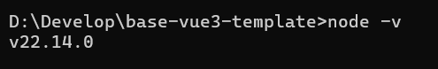
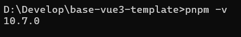
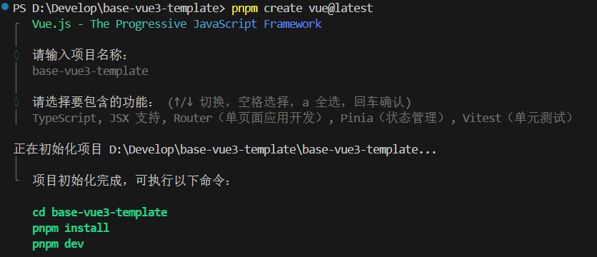

# 创建项目

[[toc]]

## 前置条件

### node 版本

::: tip

因为 eslint9 的需要 node 最好>20，本次项目 node 为 22.14.0

:::



### 包管理器

::: tip

包管理器 采用 pnpm

::: 



### vscode 插件

::: tip

vscode 插件 eslint prettier stylelint unocss vue-official postcss

::: 


### git

::: tip

安装官方 git 用代码仓库管理

:::

## 创建项目

创建 Vue 项目：

::: details 点我查看代码

```[pnpm]
pnpm create vue@latest
```

:::


