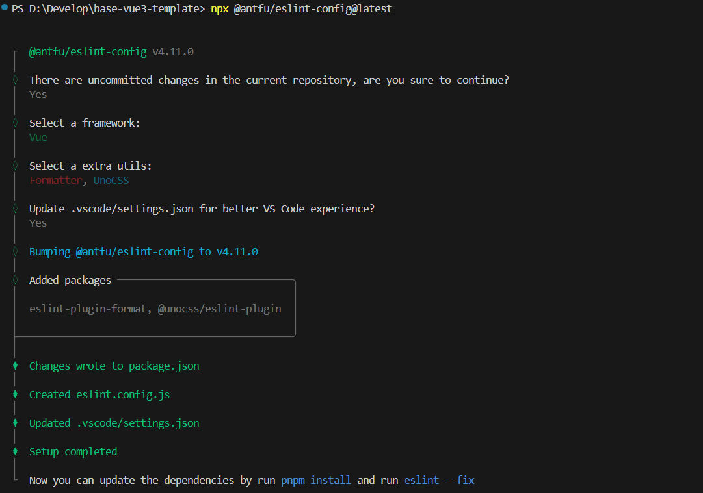
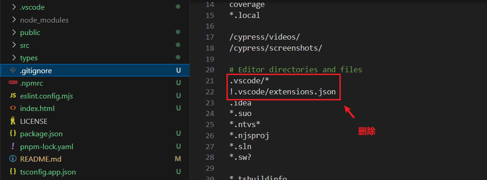

# 配置代码规范

[[toc]]

## antfu 组合 prettier&eslint

配置网站：https://github.com/antfu/eslint-config/tree/feat/support-eslint-9?tab=readme-ov-file

## 命令行界面 (CLI) 安装

> 空格选择 回车下一步

```shell
npx @antfu/eslint-config@latest
```



## 安装依赖包

::: info 依赖包

"@antfu/eslint-config": "^2.27.3",

"eslint": "^9.9.1",

"eslint-plugin-format": "^0.1.2",

"@unocss/eslint-plugin": "^0.62.3",

:::

```[pnpm]
pnpm i
```

## 配置文件

> 修改生成配置文件 eslint.config.js 为 eslint.config.mjs 用于 eslint 规则校验

```shell [eslint.config.mjs]
import antfu from '@antfu/eslint-config'

export default antfu({
  // @stylistic/eslint-plugin-plus
  stylistic: true,
  // eslint-plugin-format
  formatters: true,
  // unocss 检测&格式化 暂时注释 等配置了unocss再开放为true
  unocss: true,
  // vue的eslint配置
  vue: true,
  // 保存删除未引入的代码
  // isInEditor: false,
  // 9x版本 忽略文件这种配置方式 废弃掉eslintignore
  ignores: [
    '*.sh',
    'node_modules',
    '*.md',
    '*.woff',
    '*.ttf',
    '.idea',
    '/public',
    '/docs',
    '.husky',
    '.local',
    '/bin',
    'Dockerfile',
  ],
  lessOpinionated: true,
  rules: {
    'eslint-comments/no-unlimited-disable': 'off',
    'ts/no-use-before-define': 'off',
    'style/no-mixed-operators': 'off',
    'no-console': 'warn',
    'ts/no-unused-expressions': 'off',
    'style/max-statements-per-line': 'off',
    'ts/prefer-namespace-keyword': 'off',
    'antfu/top-level-function': 'off',
    'node/prefer-global/process': 'off',
    'ts/consistent-type-definitions': 'off',
    'ts/ban-ts-comment': 'off',
    'vue/singleline-html-element-content-newline': 'off', // vue 标签强制换行
    // 关闭一些耗时的规则
    'import/no-cycle': 'off',
    'import/no-deprecated': 'off',
    'import/no-named-as-default': 'off',
    'prefer-promise-reject-errors': 'off',
  },
})
```

## 新增脚本

```json [package.json]
{
  "scripts": {
    // ...
    "lint": "eslint .",
    "lint:fix": "eslint . --fix"
  }
}
```

## .vscode 配置文件

::: info 作用

用于保存带代码格式化

:::

生成.vscode/setting.json 修改为：

```json [.vscode/setting.json]
{
  // Disable the default formatter, use eslint instead
  "prettier.enable": false,
  "editor.formatOnSave": false,
  // Auto fix
  "editor.codeActionsOnSave": {
    "source.fixAll.eslint": "explicit",
    "source.organizeImports": "never"
  },
  // Silent the stylistic rules in you IDE, but still auto fix them
  "eslint.rules.customizations": [
    {
      "rule": "style/*",
      "severity": "off",
      "fixable": true
    },
    {
      "rule": "format/*",
      "severity": "off",
      "fixable": true
    },
    {
      "rule": "*-indent",
      "severity": "off",
      "fixable": true
    },
    {
      "rule": "*-spacing",
      "severity": "off",
      "fixable": true
    },
    {
      "rule": "*-spaces",
      "severity": "off",
      "fixable": true
    },
    {
      "rule": "*-order",
      "severity": "off",
      "fixable": true
    },
    {
      "rule": "*-dangle",
      "severity": "off",
      "fixable": true
    },
    {
      "rule": "*-newline",
      "severity": "off",
      "fixable": true
    },
    {
      "rule": "*quotes",
      "severity": "off",
      "fixable": true
    },
    {
      "rule": "*semi",
      "severity": "off",
      "fixable": true
    }
  ],
  // Enable eslint for all supported languages
  "eslint.validate": [
    "javascript",
    "javascriptreact",
    "typescript",
    "typescriptreact",
    "vue",
    "html",
    "markdown",
    "json",
    "jsonc",
    "yaml",
    "toml",
    "xml",
    "gql",
    "graphql",
    "astro",
    "svelte",
    "css",
    "less",
    "scss",
    "pcss",
    "postcss"
  ]
}
```

去除git忽略：



## 使用 styleLint

::: info 依赖包

"less": "^4.2.0",

"postcss": "^8.4.41",

"postcss-html": "^1.7.0",

"postcss-less": "^6.0.0",

"postcss-scss": "^4.0.9",

"sass": "^1.77.8",

"stylelint": "^16.8.2",

"stylelint-config-recess-order": "^5.1.0",

"stylelint-config-standard": "^36.0.1",

:::

安装：

```[pnpm]
# 选择sass 可以选择不安装包含less相关 反之亦然
pnpm i less sass postcss postcss-html postcss-less postcss-scss stylelint stylelint-config-recess-order stylelint-config-standard -D
```

配置文件：

```js [stylelint.config.mjs]
/** @type {import('stylelint').Config} */
export default {
  // stylelint-config-standard 基础配置
  // stylelint-config-recess-order 样式顺序
  extends: ['stylelint-config-standard', 'stylelint-config-recess-order'],
  // 不同文件类型用不同解析器
  overrides: [
    {
      files: ['**/*.(css|html|vue)'],
      customSyntax: 'postcss-html'
    },
    // 选less可以注释scss
    {
      files: ['*.less', '**/*.less'],
      customSyntax: 'postcss-less'
    },
    // 选sass可以注释上面的less
    {
      files: ['*.scss', '**/*.scss'],
      customSyntax: 'postcss-scss',
      rule: {
        'scss/percent-placeholder-pattern': null,
        'scss/at-mixin-pattern': null
      }
    }
  ],
  rules: {
    // 'prettier/prettier': true,
    'media-feature-range-notation': null,
    'selector-not-notation': null,
    'import-notation': null,
    'function-no-unknown': null,
    'selector-class-pattern': null,
    'selector-pseudo-class-no-unknown': [
      true,
      {
        ignorePseudoClasses: ['global', 'deep']
      }
    ],
    'selector-pseudo-element-no-unknown': [
      true,
      {
        ignorePseudoElements: ['v-deep', ':deep']
      }
    ],
    'at-rule-no-unknown': [
      true,
      {
        ignoreAtRules: [
          'tailwind',
          'apply',
          'variants',
          'responsive',
          'screen',
          'function',
          'if',
          'each',
          'include',
          'mixin',
          'extend',
          'use'
        ]
      }
    ],
    'no-empty-source': null,
    'named-grid-areas-no-invalid': null,
    'no-descending-specificity': null,
    'font-family-no-missing-generic-family-keyword': null,
    'rule-empty-line-before': [
      'always',
      {
        ignore: ['after-comment', 'first-nested']
      }
    ],
    'unit-no-unknown': [true, { ignoreUnits: ['rpx'] }],
    'order/order': [
      [
        'dollar-variables',
        'custom-properties',
        'at-rules',
        'declarations',
        {
          type: 'at-rule',
          name: 'supports'
        },
        {
          type: 'at-rule',
          name: 'media'
        },
        'rules'
      ],
      { severity: 'error' }
    ]
  },
  ignoreFiles: ['**/*.js', '**/*.jsx', '**/*.tsx', '**/*.ts']
}
```

新增脚本：

```json [package.json]
{
    "scripts": {
        // ...
        "lint:stylelint": "stylelint  \"**/*.{css,scss,less,vue,html}\" --fix"
    }
}
```

忽略文件：

```sh [.stylelintignore]
/dist/*
/public/*
```

## 代码检查插件

安装：

```[pnpm]
pnpm i vite-plugin-checker -D
```

调整 vite.config.ts：

```typescript [vite.config.ts]
import checker from 'vite-plugin-checker'

// https://vite.dev/config/
export default defineConfig({
  plugins: [
    /**
     * vite-plugin-checker 配置
     * 用于在开发环境下进行代码检查
     *
     * @returns {import('vite-plugin-checker').default} checker插件实例
     *
     * 配置说明:
     * - eslint: ESLint配置
     *   - useFlatConfig: 使用扁平配置
     *   - lintCommand: 检查命令
     *   - dev.logLevel: 开发环境日志级别
     * - overlay: 错误覆盖层配置
     *   - initialIsOpen: 初始是否打开
     */
    checker({
      eslint: {
        useFlatConfig: true,
        lintCommand: 'eslint "./src/**/*.{ts,tsx,vue}"',
        dev: {
          logLevel: ['error'],
        },
      },
      overlay: {
        initialIsOpen: true,
      },
    }),
  ],
  // ...
})
```

