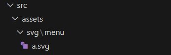

# 配置 UnoCSS

添加依赖：

```[pnpm]
pnpm install -D unocss @unocss/preset-rem-to-px @unocss/transformer-directives
```

安装图标：

```[pnpm]
pnpm install -D @iconify-json/ep @iconify-json/ant-design @iconify/utils
```

引入 UnoCSS：

```typescript [vite.config.ts]
// unocss vite插件
import UnoCSS from 'unocss/vite'

// https://vite.dev/config/
export default defineConfig({
  // ...
  plugins: [
    // ...
    UnoCSS()
  ]
})
```

配置 UnoCSS：

```typescript [uno.config.ts]
// uno.config.ts
import fs from 'node:fs'
import path from 'node:path'
// 预设rem转px
import presetRemToPx from '@unocss/preset-rem-to-px'
// transformerDirectives 可以使用 @apply @screen theme函数
import transformerDirective from '@unocss/transformer-directives'
import {
  defineConfig,
  presetAttributify,
  presetIcons,
  presetUno,
  transformerVariantGroup
} from 'unocss'

// import { FileSystemIconLoader } from '@iconify/utils/lib/loader/node-loaders'
// loader helpers -- pnpm i @iconify/utils -D 官网的不晓得为啥 jenkins 打包总会出点问题
// TODO: 上面失效用下面替代 pnpm i unplugin-icons -D
import { FileSystemIconLoader } from 'unplugin-icons/loaders'

// SVG图标基础目录
const SVG_BASE_DIR = './src/assets/svg'

export default defineConfig({
  presets: [
    presetAttributify(),
    // {
    // 忽略的属性
    // ignoreAttributes: ['container', 'table'],
    // }
    presetUno(),
    // 现在mt-1会转换为 margin-top: 1px
    presetRemToPx({
      baseFontSize: 4
    }),
    // 自动引入图标配置
    presetIcons({
      scale: 1.2,
      // warn: true,
      // 全局自定义图标转换
      customizations: {
        transform(svg, collection) {
          // 如果是menu图标，则添加fill="currentColor"
          if (collection === 'menu') {
            return svg.replace(/^<svg /, '<svg fill="currentColor" ')
          }
          return svg
        }
      },
      collections: {
        // 本地SVG图标集合 自动读取SVG_BASE_DIR下面文件夹里面的图标 使用方式为 i-文件夹名称-图标名称
        ...loadLocalSvgCollections(),
        // 按需加载的图标集合 非必须
        // 'ant-design': () => import('@iconify-json/ant-design/icons.json').then(i => i.default),
        ep: () => import('@iconify-json/ep/icons.json').then(i => i.default)
      }
    })
  ],
  // 安全列表 动态图标需要 例如：<div i-menu-home /> 菜单图标是后端返回的需要动态处理
  safelist: generateSafeList(['menu']), // 传入数组参数
  transformers: [transformerDirective(), transformerVariantGroup()],
  // 自定义配置
  rules: [
    // 自定义配置
    // 以下官网规则可自定义转换
    // [/^m-(\d+)$/, ([, d]) => ({ margin: `${d / 4}rem` })],
    // [/^p-(\d+)$/, match => ({ padding: `${match[1] / 4}rem` })],
    /** 以下官网规则可自定义转换 */
    /* 例如 m-1 转换为 margin:0.25rem */
    // [/^m-(\d+)$/, ([, d]) => ({margin: `${d / 4}rem`})],
    // [/^p-(\d+)$/, match => ({padding: `${match[1] / 4}rem`})],
    [
      /^bg-img-\[(.+)\]$/,
      ([, value]) => {
        // 替换下划线为正常的路径分隔符
        const path = value.replace(/_/g, '/')
        return {
          'background-image': `url(${path})`,
          'background-repeat': 'no-repeat',
          'background-size': '100% 100%'
        }
      }
    ]
  ],
  // 自定义属性 一个属性可以对应多个unocss类值
  shortcuts: [
    // 动态快捷方式
    /**
     *   t+字号+透明度+加粗
     *   t14 就变成 text-14 color=rgba(37,51,71,1)
     *   t145 就变成 text-14 color=rgba(37,51,71,0.55)
     *   t14b5 就变成 text-14 color=rgba(37,51,71,1) font-weight: 500
     *   t145b5 就变成 text-14 color=rgba(37,51,71,0.55) font-weight: 500
     */
    [
      /^t(\d{2})(\d)?(b\d+)?$/,
      ([, size, opacity, weight]) => {
        const fontSize = `text-${size}`
        const fontWeight = weight ? `font-${weight.slice(1)}00` : ''
        const opacityValue = opacity
          ? (Number(opacity) * 0.1 + 0.05).toFixed(2)
          : '1'
        const color = `text-[rgba(37,51,71,${opacityValue})]`
        return `${fontSize} ${fontWeight} ${color}`
      }
    ],
    {
      // 垂直水平居中
      'flex-center': 'flex justify-center items-center',
      // 放在最后
      'flex-col-end': 'flex justify-end items-center',
      // 垂直居中
      'flex-middle': 'flex items-center',
      // 分开两边
      'flex-between': 'flex justify-between items-center',
      // 竖直居中
      'flex-col-center': 'flex flex-col justify-center',
      // 字体基线对其
      'flex-baseline': 'flex items-baseline'
    }
  ],
  theme: {
    breakpoints: {
      sm: '640px',
      md: '768px',
      lg: '1024px',
      xl: '1280px'
    }
  }
})
// 本地 SVG 图标存放目录 用于动态渲染图标 例如：菜单按钮
function generateSafeList(collections: string[]) {
  const safeList: string[] = []
  collections.forEach((collection) => {
    try {
      const dirPath = path.resolve(SVG_BASE_DIR, collection)
      if (fs.existsSync(dirPath) && fs.statSync(dirPath).isDirectory()) {
        const files = fs.readdirSync(dirPath)
        const icons = files
          .filter(file => file.endsWith('.svg'))
          .map(file => `i-${collection}-${path.basename(file, '.svg')}`)
        safeList.push(...icons)
      }
    }
    catch (error) {
      console.error(`无法读取图标集合 ${collection}:`, error)
    }
  })

  return safeList
}

// 加载本地SVG图标集合
function loadLocalSvgCollections() {
  const result: Record<string, ReturnType<typeof FileSystemIconLoader>> = {}

  try {
    // 读取SVG_BASE_DIR目录下的所有内容
    const items = fs.readdirSync(SVG_BASE_DIR)

    // 筛选出文件夹
    const collections = items.filter((item) => {
      const itemPath = path.join(SVG_BASE_DIR, item)
      return fs.existsSync(itemPath) && fs.statSync(itemPath).isDirectory()
    })

    // 为每个文件夹创建FileSystemIconLoader
    collections.forEach((collection) => {
      result[collection] = FileSystemIconLoader(
        path.join(SVG_BASE_DIR, collection)
      )
    })
  }
  catch (error) {
    console.error(`无法读取SVG图标目录 ${SVG_BASE_DIR}:`, error)
  }
  return result
}
```

全局配置：

```typescript [main.ts]
import 'virtual:uno.css' // 引入 uno.css
```

使用：

::: tip 提示

使用图标时：`i前缀-ep图库名:lock图标名称`

:::

添加本地svg图标：



测试：

```vue
<script setup lang="ts">

const cherry = ref('i-ep:cherry')

const a = ref('a')
</script>

<template>
  <div class="h-100 w-100 bg-red-800 text-30 text-blue hover:text-black">
    小猫米
  </div>
  <div grid="~ cols-[100px_1fr_1fr] md:cols-[100px_1fr_2fr]" mt30 h200 w-full gap10 border="10 solid #ddd">
    <div bg-red />
    <div bg-green />
    <div bg-blue />
    <div bg-red />
    <div bg-green />
    <div bg-blue />
  </div>
  <!-- 字体 -->
  <div text-20 text-op-55 font-600 color="[rgba(37,51,71,1)]">字体</div>
  <div t205b6>字体</div>
  <!-- 图片 -->
  <div h100 w100 bg="img-[@/assets/logo.svg]" />
  <div i-menu-a />
  <div :class="`i-menu-${a}`" h50 w50 />
  <!-- element icon 需要引入 element图标 -->
  <div class="i-ep:cherry" h50 w50 />
  <div :class="cherry" h50 w50 />
</template>
```

