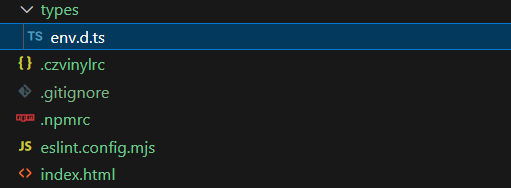

# 调整项目

[[toc]]

## 配置.npmrc

> .npmrc 是 npm 运行时配置文件，用于设置依赖包的安装来源。 [https://pnpm.io/zh/npmrc](https://gitee.com/link?target=https%3A%2F%2Fpnpm.io%2Fzh%2Fnpmrc)

根目录新建 `.npmrc `以便于 pnpm

``` shell [.npmrc]
# 使用淘宝镜像源
registry = https://registry.npmmirror.com
# registry = https://registry.npmjs.org

# 根据需要提升含有以下的依赖包到根 node_modules 目录下
public-hoist-pattern[]=husky
public-hoist-pattern[]=*eslint*
public-hoist-pattern[]=@eslint*
public-hoist-pattern[]=*prettier*
public-hoist-pattern[]=lint-staged
public-hoist-pattern[]=*stylelint*
public-hoist-pattern[]=@commitlint*
public-hoist-pattern[]=core-js

# 提升所有依赖到根 node_modules 目录下，相当于 public-hoist-pattern[]=*，与上面一种方式一般二选一使用
# 极不推荐用这样的方式解决依赖问题，这样没有充分利用 pnpm 依赖访问安全性的优势，又走回了 npm / yarn 的老路。
# shamefully-hoist=true

enable-pre-post-scripts=true
engine-strict=true
package-manager-strict=false
```


## 强制使用 pnpm & 限制 node & pnpm 版本

```json [package.json]
"engines": {
  "node": "^18.18.0 || ^20.9.0 || >=21.1.0",
  "pnpm": ">=7.33.7"
},
"scripts": {
  "preinstall": "npx only-allow pnpm",
  // ...
},
```

## 调整 Router

调整 router：

```typescript [src/router/index.ts]
import type { App } from 'vue'
import type { RouteRecordRaw } from 'vue-router'
import { createRouter, createWebHistory } from 'vue-router'
import HomeView from '../views/HomeView.vue'

const routes: RouteRecordRaw[] = [
  {
    path: '/',
    name: 'home',
    component: HomeView
  },
  {
    path: '/about',
    name: 'about',
    // route level code-splitting
    // this generates a separate chunk (About.[hash].js) for this route
    // which is lazy-loaded when the route is visited.
    component: () => import('../views/AboutView.vue')
  }
]

const router = createRouter({
  history: createWebHistory(import.meta.env.BASE_URL),
  routes
})

// export default router
export function useRouter(app: App) {
  app.use(router)
}
```

调整 main.ts

```typescript [src/main.ts]
import { createPinia } from 'pinia'

import { createApp } from 'vue'
import App from './App.vue'

import { useRouter } from './router'

const app = createApp(App)

app.use(createPinia())
useRouter(app)

app.mount('#app')
```

## 调整 Pinia

添加持久化插件：

```[pnpm]
pnpm install pinia-plugin-persistedstate
```

新建 stores/index.ts：

```typescript [src/stores/index.ts]
import type { App } from 'vue'
import { createPinia } from 'pinia'
import piniaPluginPersistedstate from 'pinia-plugin-persistedstate'

export function usePinia(app: App) {
  const pinia = createPinia()
  pinia.use(piniaPluginPersistedstate)
  app.use(pinia)
}
```

调整 main.ts

```typescript [src/main.ts]
import { createApp } from 'vue'
import App from './App.vue'

import { useRouter } from './router'
import { usePinia } from './stores'

const app = createApp(App)

useRouter(app)
usePinia(app)

app.mount('#app')
```

使用：

```vue [AboutView.vue]
<script setup>
import { useCounterStore } from '@/stores/counter'

const counter = useCounterStore()
</script>

<template>
  <div class="about">
    <h1>This is an about page {{ counter.count }}</h1>
    <button @click="counter.increment">加一</button>
  </div>
</template>

<style>
@media (min-width: 1024px) {
  .about {
    display: flex;
    align-items: center;
    min-height: 100vh;
  }
}
</style>
```

```typescript [src/stores/counter.ts]
import { defineStore } from 'pinia'
import { computed, ref } from 'vue'

export const useCounterStore = defineStore(
  'counter',
  () => {
    const count = ref(0)
    const doubleCount = computed(() => count.value * 2)
    function increment() {
      count.value++
    }
    return { count, doubleCount, increment }
  },
  {
    persist: [
      {
        pick: ['count'], // 指定字段
        storage: localStorage // 存储方式
      }
    ]
  }
)
```

## 调整类型声明文件

新建 types 文件夹并将 env.d.ts 文件移动到 types：



调整 tsconfig.node.json：

```json [tsconfig.node.json]
{
  "extends": "@tsconfig/node22/tsconfig.json",
  "compilerOptions": {
    "tsBuildInfoFile": "./node_modules/.tmp/tsconfig.node.tsbuildinfo",

    "module": "ESNext",
    "moduleResolution": "Bundler",
    "types": ["node"],
    "noEmit": true
  },
  "include": [
    "vite.config.*",
    "vitest.config.*",
    "cypress.config.*",
    "nightwatch.conf.*",
    "playwright.config.*",
    "eslint.config.*",
    "types"
  ]
}
```

调整 tsconfig.app.json：

```json [tsconfig.app.json]
{
  "extends": "@vue/tsconfig/tsconfig.dom.json",
  "compilerOptions": {
    "tsBuildInfoFile": "./node_modules/.tmp/tsconfig.app.tsbuildinfo",

    "paths": {
      "@/*": ["./src/*"],
      "#/*": ["./types/*"]
    }
  },
  "include": ["types", "src/**/*", "src/**/*.vue"],
  "exclude": ["src/**/__tests__/*"]
}
```

## 添加types的类型别名

调整vite.config.ts：

```typescript [vite.config.ts]
import { fileURLToPath, URL } from 'node:url'

import { defineConfig } from 'vite'
import vue from '@vitejs/plugin-vue'
import vueJsx from '@vitejs/plugin-vue-jsx'
import vueDevTools from 'vite-plugin-vue-devtools'

// https://vite.dev/config/
export default defineConfig({
  plugins: [
    vue(),
    vueJsx(),
    vueDevTools(),
  ],
  resolve: {
    alias: {
      '@': fileURLToPath(new URL('./src', import.meta.url)),
      '#': fileURLToPath(new URL('./types', import.meta.url)), // [!code ++]
    },
  },
})
```

调整 tsconfig.app.json：

```json [tsconfig.app.json]
{
  "extends": "@vue/tsconfig/tsconfig.dom.json",
  "compilerOptions": {
    "tsBuildInfoFile": "./node_modules/.tmp/tsconfig.app.tsbuildinfo",

    "paths": {
      "@/*": ["./src/*"],
      "#/*": ["./types/*"] // [!code ++]
    }
  },
  "include": ["types", "src/**/*", "src/**/*.vue"],
  "exclude": ["src/**/__tests__/*"]
}
```

## 调整不能识别 vue 文件

typescript 不能识别 .vue 文件

解决方法：可以在 env.d.ts 文件中添加以下代码：

```typescript [env.d.ts]
/// <reference types="vite/client" />
declare module '*.vue' {
  import type { DefineComponent } from 'vue'

  const vueComponent: DefineComponent<object, object, any>
  export default vueComponent
}
```
