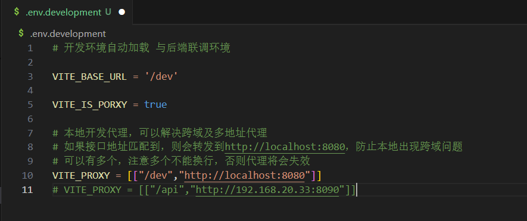

# 基础操作
## 安装依赖

```sh
pnpm install
```

## 启动开发环境

```sh
pnpm dev
```

## 构建项目

```sh
pnpm build
```

## 运行测试

```sh
pnpm test:unit
```

## 生成接口

1. 调整在线 swagger 地址：

   

2. 调整返回类型名：

   

3. 配置跨域地址：

   